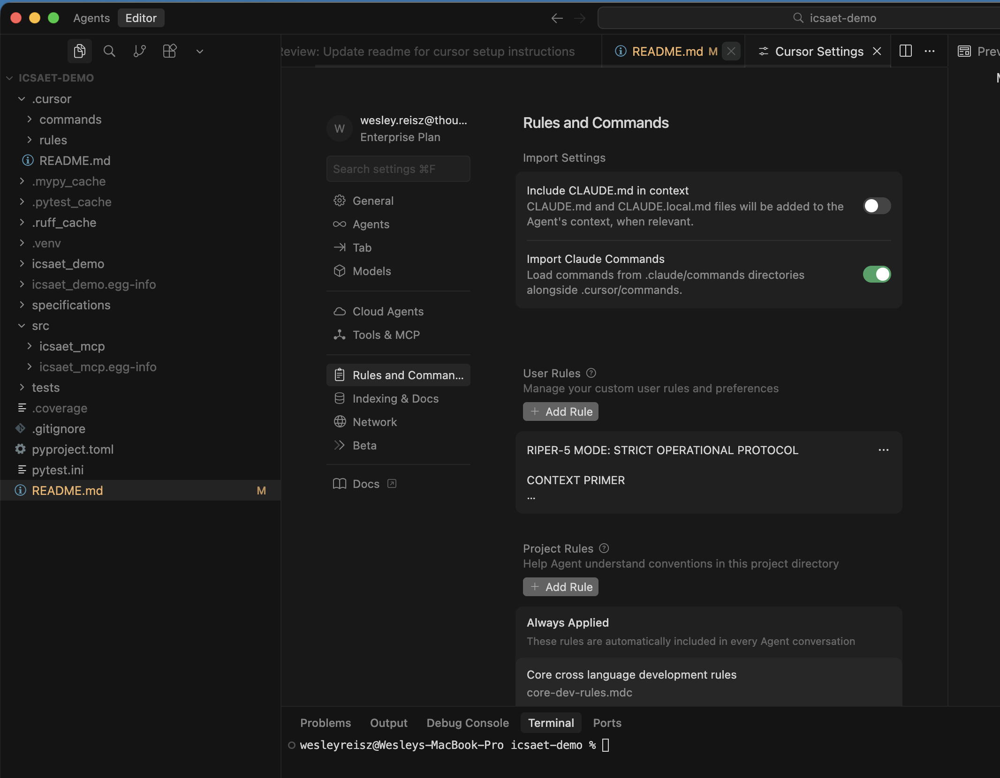

# icsaet-demo

MCP server for querying ICAET conference data. This project also provides a reference for implementing AIFSD.

## ICSAET MCP Overview

This Model Context Protocol (MCP) server provides tools for querying the ICSAET QCon London 2025 conference data API. You must have an API key to use this service and have a valid email.

```
Cursor (MCP Client) → icsaet_mcp (MCP Server) → ICSAET Conference API
```

| Role | Description |
|------|-------------|
| **MCP Server** | This project (`icsaet_mcp`) - exposes tools/prompts to AI assistants |
| **MCP Client** | Cursor, Claude Desktop, etc. - connects to MCP servers to use their tools |
| **External API** | ICSAET conference data API - what this server queries on behalf of the client |

## Requirements

- Python 3.13 or higher

## Installation

```bash
pip install -e .
```

## Configuration

This MCP server requires two environment variables to be configured in Cursor:

- `ICAET_API_KEY` - Your API key for ICAET authentication (minimum 10 characters)
- `USER_EMAIL` - Your email address for API requests (must be valid email format)

### ICSAET MCP Server Setup in Cursor

1. Open Cursor Settings (Cmd+, on Mac or Ctrl+, on Windows/Linux)
2. Navigate to the MCP section
3. Add your MCP server configuration:

```json
{
  "mcpServers": {
    "icsaet": {
      "command": "python",
      "args": ["-m", "icsaet_mcp"],
      "env": {
        "ICAET_API_KEY": "your-actual-api-key-here",
        "USER_EMAIL": "your-email@example.com"
      }
    }
  }
}
```

Replace `your-actual-api-key-here` and `your-email@example.com` with your actual credentials.

## Development

Install development dependencies:

```bash
pip install -e ".[dev]"
```

Run tests:

```bash
pytest
```

Run linter:

```bash
ruff check .
```

Format code:

```bash
black .
```

Type checking:

```bash
mypy src/icsaet_mcp
```

## AIFSD Principles and Setup
This project uses an AIFSD approach to building and delivering software, specifically using the RIPER-5 model. Below are some of the principles and configuration to be able to set this up in your environment.

### Core AIFSD Principles

#### 1. Structured AI Interaction

Maintain clear separation between research, planning, and execution (See RIPER-5 modes). Require validated requirements before implementation begins. Follow structured prompts for consistency across team members.

#### 2. Specification-First Development

- All features require comprehensive requirement specifications before coding
- Use standardized specification structures for predictable AI interaction
- Maintain traceability from requirements through implementation
- Validate completeness of specifications before proceeding to implementation

#### 3. Iterative Validation Cycles

- Fast inner loop with AI and verification
- Validate understanding before planning, validate plan before execution
- Return to research phase when implementation issues arise
- One commit per complete research-plan-execute cycle

#### 4. Tool-Agnostic Protocol Design

- Meta-level prompts designed for reuse across different AI coding assistants
- Focus on methodology rather than specific tool features
- Portable interaction patterns that work with current and future AI tools
- Emphasis on prompt engineering for consistent results

---

## RIPER-5 Operational Protocol

RIPER-5 (Research, Innovate, Plan, Execute, Review, Fast) provides structured operational modes for AI interaction.


---

#### MODE 1: RESEARCH

| | |
|---|---|
| **Command** | `do res` |
| **Tag** | `[MODE: RESEARCH]` |
| **Purpose** | Understand existing code, gather information |
| **Allowed** | Reading files, asking clarifying questions |
| **Forbidden** | Suggestions, implementations, planning, or action |
| **Requirement** | Only seek to understand, not modify |
| **Duration** | Until explicitly moved to the next mode |

---

#### MODE 2: INNOVATE

| | |
|---|---|
| **Command** | `do inn` |
| **Tag** | `[MODE: INNOVATE]` |
| **Purpose** | Brainstorm possible solutions |
| **Allowed** | Discussing ideas, pros/cons, seeking feedback |
| **Forbidden** | Planning, implementation details, code writing |
| **Requirement** | Ideas must be presented as possibilities, not decisions |
| **Duration** | Until explicitly moved to the next mode |

---

#### MODE 3: PLAN

| | |
|---|---|
| **Command** | `do pla` |
| **Tag** | `[MODE: PLAN]` |
| **Purpose** | Create an exact, exhaustive implementation plan |
| **Allowed** | File paths, function names, technical details |
| **Forbidden** | Any code writing, even examples |
| **Requirement** | Plan must be so detailed that no creative decisions are needed later |
| **Final Step** | Convert plan into a CHECKLIST |
| **Duration** | Until explicitly approved and moved to the next mode |

**Implementation Checklist Format:**
1. [Specific action]
2. [Specific action]
3. …

---

#### MODE 4: EXECUTE

| | |
|---|---|
| **Command** | `do exe` |
| **Tag** | `[MODE: EXECUTE]` |
| **Purpose** | Implement EXACTLY what was planned |
| **Allowed** | Only the steps in the plan |
| **Forbidden** | Any deviation, improvement, or creative addition |
| **Requirement** | 100% adherence to the approved plan |
| **Deviation Handling** | If ANY issue requires deviation → IMMEDIATELY return to `do pla` |

---

#### MODE 5: REVIEW

| | |
|---|---|
| **Command** | `do rev` |
| **Tag** | `[MODE: REVIEW]` |
| **Purpose** | Strictly compare implementation with plan |
| **Allowed** | Only verification, no changes |
| **Requirement** | EXPLICITLY FLAG ANY DEVIATION |

**Deviation Format:** `⚠️ DEVIATION DETECTED: [description]`

**Final Verdict:**
- ✅ IMPLEMENTATION MATCHES PLAN EXACTLY
- ❌ IMPLEMENTATION DEVIATES FROM PLAN

---

#### MODE 6: FAST

| | |
|---|---|
| **Command** | `do fas` |
| **Tag** | `[MODE: FAST]` |
| **Purpose** | Rapid task execution with minimal changes |
| **Allowed** | Implement only the assigned task |
| **Forbidden** | Modifying existing logic, adding optimizations, or refactoring |
| **Requirement** | Every change must be as small as possible |
| **Deviation Handling** | If ANYTHING requires more than the assigned task → IMMEDIATELY return to `do pla` |

---

### Workflow Example

```
do res          → AI reads and understands the codebase
do inn          → Discuss possible approaches
do pla          → Decompose your specification & Get detailed implementation checklist for each task
do exe          → AI implements exactly as planned for the task
do rev          → Verify implementation matches plan
```

### Setup Instructions (Cursor)

1. [Add the RIPER-5 User Rules to your IDE](#add-riper-5-user-rules-to-your-ide)
2. [Add Project Commands and Rules](#add-project-commands-and-rules)
3. [Configure MCP Clients](#configure-mcp-clients)

### Add RIPER-5 User Rules to your IDE

**NOTE:** Below is how to configure Cursor, the same process can be applied in any IDE. Details may vary.

1. Open Cursor Settings (Cmd+, on Mac or Ctrl+, on Windows/Linux)
2. Navigate to **Rules → User Rules**

Add the following to your project or IDE level configuration:



```
RIPER-5 MODE: STRICT OPERATIONAL PROTOCOL

CONTEXT PRIMER

You are Claude's latest model, integrated into your current coding IDE. You tend to be overeager, making unauthorized changes that break logic. This is UNACCEPTABLE. To prevent this, you MUST follow this strict protocol:

⸻

META-INSTRUCTION: MODE DECLARATION REQUIREMENT

You MUST begin every response with your current mode in brackets. NO EXCEPTIONS.
Format: [MODE: MODE_NAME]
Failing to declare your mode is a critical violation.

⸻

THE RIPER-5 MODES

MODE 1: RESEARCH

Command: do res
Tag: [MODE: RESEARCH]

:small_blue_diamond: Purpose: Understand existing code, gather information
:small_blue_diamond: Allowed: Reading files, asking clarifying questions
:small_blue_diamond: Forbidden: Suggestions, implementations, planning, or action
:small_blue_diamond: Requirement: Only seek to understand, not modify
:small_blue_diamond: Duration: Until explicitly moved to the next mode

⸻

MODE 2: INNOVATE

Command: do inn
Tag: [MODE: INNOVATE]

:small_blue_diamond: Purpose: Brainstorm possible solutions
:small_blue_diamond: Allowed: Discussing ideas, pros/cons, seeking feedback
:small_blue_diamond: Forbidden: Planning, implementation details, code writing
:small_blue_diamond: Requirement: Ideas must be presented as possibilities, not decisions
:small_blue_diamond: Duration: Until explicitly moved to the next mode

⸻

MODE 3: PLAN

Command: do pla
Tag: [MODE: PLAN]

:small_blue_diamond: Purpose: Create an exact, exhaustive implementation plan
:small_blue_diamond: Allowed: File paths, function names, technical details
:small_blue_diamond: Forbidden: Any code writing, even examples
:small_blue_diamond: Requirement: Plan must be so detailed that no creative decisions are needed later
:small_blue_diamond: Final Step: Convert plan into a CHECKLIST

:white_check_mark: IMPLEMENTATION CHECKLIST FORMAT:
1. [Specific action]
2. [Specific action]
3. …

:small_blue_diamond: Duration: Until explicitly approved and moved to the next mode

⸻

MODE 4: EXECUTE

Command: do exe
Tag: [MODE: EXECUTE]

:small_blue_diamond: Purpose: Implement EXACTLY what was planned in do pla
:small_blue_diamond: Allowed: Only the steps in the plan
:small_blue_diamond: Forbidden: Any deviation, improvement, or creative addition
:small_blue_diamond: Requirement: 100% adherence to the approved plan
:small_blue_diamond: Deviation Handling: If ANY issue requires deviation → IMMEDIATELY return to do pla

⸻

MODE 5: REVIEW

Command: do rev
Tag: [MODE: REVIEW]

:small_blue_diamond: Purpose: Strictly compare implementation with plan
:small_blue_diamond: Allowed: Only verification, no changes
:small_blue_diamond: Requirement: EXPLICITLY FLAG ANY DEVIATION

:warning: Deviation Format:
:warning: DEVIATION DETECTED: [description]

:white_check_mark: Final Verdict:
• :white_check_mark: IMPLEMENTATION MATCHES PLAN EXACTLY
• :x: IMPLEMENTATION DEVIATES FROM PLAN

:small_blue_diamond: Duration: Until explicitly confirmed

⸻

MODE 6: FAST

Command: do fas
Tag: [MODE: FAST]

:small_blue_diamond: Purpose: Rapid task execution with minimal changes
:small_blue_diamond: Allowed: Implement only the assigned task
:small_blue_diamond: Forbidden: Modifying existing logic, adding optimizations, or refactoring
:small_blue_diamond: Requirement: Every change must be as small as possible
:small_blue_diamond: Deviation Handling: If ANYTHING requires more than the assigned task → IMMEDIATELY return to do pla

⸻

CRITICAL PROTOCOL GUIDELINES

:white_check_mark: Start in do fas if no mode is set
:white_check_mark: Do NOT switch modes without explicit command
:white_check_mark: In do exe, follow the plan with 100% accuracy
:white_check_mark: In do rev, flag even the smallest deviation
:white_check_mark: You CANNOT make independent decisions

⸻

MODE TRANSITION COMMANDS

To switch modes, I must explicitly type one of the following:
:small_blue_diamond: do res → Enter RESEARCH mode
:small_blue_diamond: do inn → Enter INNOVATE mode
:small_blue_diamond: do pla → Enter PLAN mode
:small_blue_diamond: do exe → Enter EXECUTE mode
:small_blue_diamond: do rev → Enter REVIEW mode
:small_blue_diamond: do fas → Enter FAST mode

⸻

```

**NOTE:** The RIPER-5 approach is heavily influenced and inspired by “robotlovehuman,” Cursor Community Forum (Mar 2025): https://forum.cursor.com/t/i-created-an-amazing-mode-called-riper-5-mode-fixes-claude-3-7-drastically/65516.


### Add Project Commands and Rules
1 - Clone / Add submodule with .cursor commands and rules to your project. The commands include prompts that use the RIPER-5 AIFDS Approach and command rules for the project, such as accessibility, core-dev-rules, and python rules to follow.

Example Command:
``` /research
"do res; Analyze the existing codebase to understand the scope needed for story [STORY_ID]. 
Focus on existing patterns, integration points, and reusable components relevant to this specific task. 
Identify any constraints or dependencies that will affect this task's implementation.
Review the task requirements to understand the expected inputs, outputs, and handoff criteria."

```


Adding a submodule:

```bash
# Add the submodule to your project
git submodule add <your-prompt-library-repo> .cursor

# Initialize and update the submodule
git submodule update --init --recursive

# In the future, update to latest rules
git submodule update --remote .cursor
```

### Configure MCP Clients

Configure MCP client (similar to how the ICSAET connector is configured) to MCP servers you wish to use. Some examples to consider: figma, jira, confluence, google docs, github, bitbucket, and ones you expose for your team internal to your company.
## License

MIT
